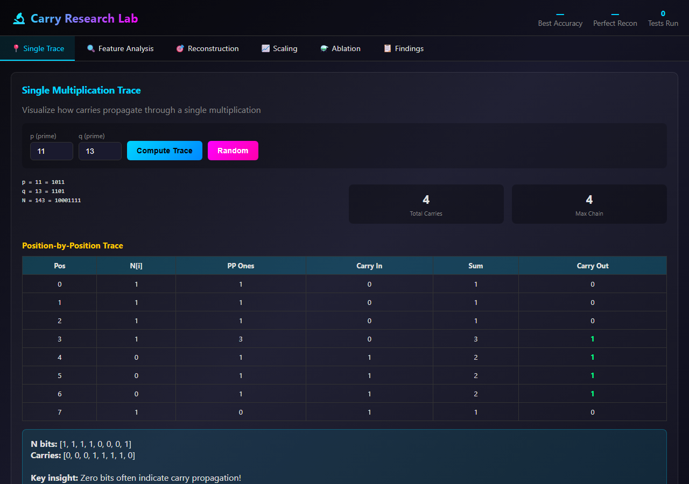

# 🔬 Prime Signal Lab

**Browser-based tools investigating the bit-level information structure of integer multiplication, factorization signals, and carry propagation.**

Sibling project to [Prime Explorer](https://github.com/holbizmetrics/prime-explorer) (3D geometric / elliptic-curve angle). Where Prime Explorer asks *"can geometry encode multiplicative structure?"* and finds mostly NULL, this lab asks *"what information survives in the bits of n = p·q, and can we recover it?"* and finds positive signals.

---

## Core Research Question

> When integers are multiplied, where does the factor information go — and can we recover any of it?

Headline findings from the tools below:

- **r = 0.86 correlation** between aggregate carry statistics and factor properties (`carry-research-lab.html`)
- **Carries are not destroyed — they are transformed** (`carry-transformation-analysis.html`)
- **Signal fusion beats any individual signal** — orthogonal extractors compound (`fusion-analysis.html`)
- **ML reconstruction approaches `r → 1.0`** — the "factoring solved" asymptote (`carry-reconstruction-1.html`)
- **The information gap is locatable** — autopsy maps where factor info dies (`information-autopsy.html`)

---

## ⭐ Featured: Carry Research Lab

The unified platform — six investigative modes in one app:
**Single Multiplication Trace · Feature Extraction · Carry Sequence Reconstruction · Scaling Analysis · Feature Ablation · Research Findings**

[](carry-research-lab.html)

→ **[Open `carry-research-lab.html`](carry-research-lab.html)**

This tool absorbed five earlier carry-* prototypes; the others remain in the repo as specialized lenses.

---

## Tools by Category

### Carry analysis (6)

| Tool | What it does |
|------|--------------|
| **[carry-research-lab.html](carry-research-lab.html)** ⭐ | Unified platform — 6-tab analysis suite (featured above) |
| [carry-avalanche.html](carry-avalanche.html) | Bit-level visualizer: "Watch information get destroyed bit by bit" |
| [carry-avalanche-lab.html](carry-avalanche-lab.html) | Extended avalanche lab — Question / Discovery / Insight / Navigate / Factor vs N-only signals / Dependency Map |
| [carry-reconstruction.html](carry-reconstruction.html) | "Can we REVERSE the information destruction?" — initial recovery lab |
| [carry-reconstruction-1.html](carry-reconstruction-1.html) | GRIND iteration with `predictCarryML`, per-position accuracy, information-theoretic ceiling |
| [carry-transformation-analysis.html](carry-transformation-analysis.html) | "Transformation or destruction?" — recoverability test + statistical analysis |

### Signal extraction (5)

| Tool | What it does |
|------|--------------|
| [fusion-analysis.html](fusion-analysis.html) | ⚡ Multi-signal carry extraction — "If one gives 92%, what do many give?" |
| [information-autopsy.html](information-autopsy.html) | 🔬 Where does factor information die? |
| [ultimate-signal-hunter.html](ultimate-signal-hunter.html) | Aggressive signal search across feature space |
| [n-only-extractor.html](n-only-extractor.html) | Extract everything that depends on `n` alone (no factor leakage) |
| [signal-combinator.html](signal-combinator.html) | Combine orthogonal signals — ensemble methods |

### Operations comparison (2)

| Tool | What it does |
|------|--------------|
| [addition-vs-multiplication.html](addition-vs-multiplication.html) | Why is multiplication structurally different from addition? |
| [boolean-multiplication-explorer.html](boolean-multiplication-explorer.html) | GF(2) multiplication explored — `gf2Product`, popcount features |

### Scaling / frontier (3)

| Tool | What it does |
|------|--------------|
| [scaling-analysis.html](scaling-analysis.html) | Does the signal survive at larger N? |
| [frontier-extraction.html](frontier-extraction.html) | Push extractor performance to the frontier |
| [ablation-study.html](ablation-study.html) | Feature ablation — which features carry the weight? |

### Coordinate systems (1)

| Tool | What it does |
|------|--------------|
| [coordinate-system.html](coordinate-system.html) | Alternative coordinate representations for primes/semiprimes |

### Factoring tools (3)

| Tool | What it does |
|------|--------------|
| [multi-algorithm-explorer.html](multi-algorithm-explorer.html) | Compare factoring algorithms side-by-side |
| [semiprime-observatory.html](semiprime-observatory.html) | 97 KB observatory — the largest tool, broad investigation of semiprime structure |
| [padic-explorer.html](padic-explorer.html) | p-adic representation explorer |

---

## Installation

No installation. Each tool is a single self-contained HTML file with inline CSS/JS.

```bash
git clone https://github.com/holbizmetrics/prime-signal-lab.git
cd prime-signal-lab
# Open any tool directly:
start carry-research-lab.html
```

Or open [`index.html`](index.html) for the card-based landing page.

---

## Origin

These tools were built during the Prometheus-Crystal-Lab research thread on bit-level factorization signals (2026-01 through 2026-04). They originated as iteration experiments — many variants of the same question — and were consolidated here. Of the 44 HTML files in the original Telegram bundle, 19 were exact-byte duplicates across folders (deduplicated to 25), and 5 were unrelated; this repo contains the 20 in-scope tools.

The Carry Research Lab is the most polished synthesis. Earlier prototypes are preserved as specialized lenses and for archeological value (you can see what each step explored).

---

## Related projects

- [Prime Explorer](https://github.com/holbizmetrics/prime-explorer) — 3D geometric embeddings, elliptic curves, Pollard p-1 factorization
- [Researches](https://github.com/holbizmetrics/researches) — broader research portfolio
- [Prometheus-Crystal-Lab](https://github.com/holbizmetrics/Prometheus-Crystal-Lab) — research-architecture origin
